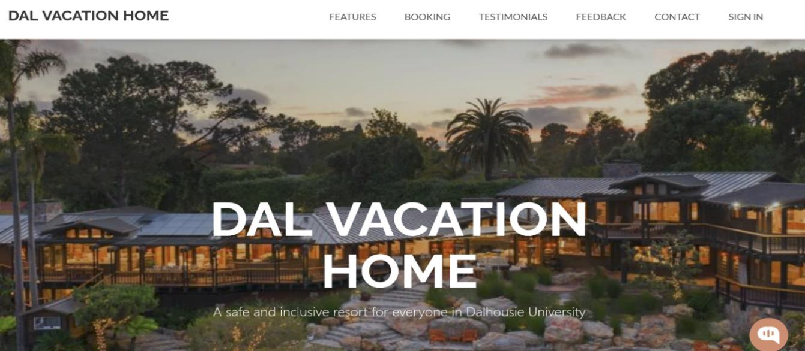
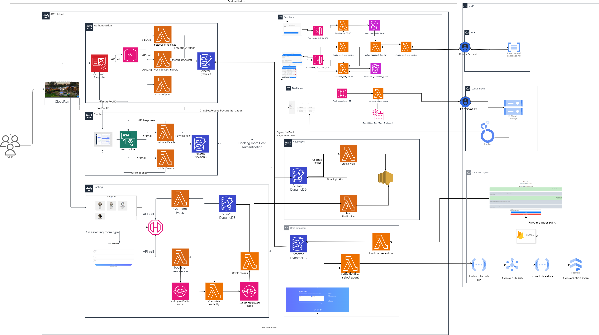

# DalVacationHome – Serverless Data Processing

A cloud-based serverless web application designed for room bookings, user authentication, live chat with agents, notifications, and feedback analysis. The project leverages AWS and GCP services to deliver a scalable, secure, and fully automated experience.

## 📑 Features

### 🗨️ Virtual Assistant (DalBot)

- Built with **Amazon Lex** and **AWS Lambda**.
- Helps users with booking details, FAQs, and navigation.
- Integrated with **DynamoDB** for retrieving booking details.
- React-based custom chatbot UI.

### 🛠️ Admin Dashboard

- Built with **React + AWS Lambda + DynamoDB**.
- Features include:
  - Add new room types.
  - Update existing room details.
  - Delete rooms.
- Ensures only authenticated admin users can modify data.

### 🔐 User Authentication

- **Multi-layer authentication** system:
  1. **AWS Cognito** for sign-up/sign-in and user pool management.
  2. **Security question & answer verification**.
  3. **Caesar cipher decryption challenge** for enhanced security.
- Role-based access control for admins and users.

### 🏨 Booking System

- Serverless backend with **AWS Lambda + DynamoDB + API Gateway**.
- Users can:
  - View available rooms.
  - Create bookings.
  - Receive booking confirmation/rejection emails.

### 📬 Notifications

- **AWS SNS** used for event-driven notifications:
  - Account creation confirmations.
  - Login alerts with timestamp.
  - Booking confirmations or failures.
  - Chat invitations for live agent support.

### 💬 Live Chat (Multi-cloud Integration)

- **AWS Lambda + GCP Pub/Sub + Firestore + Firebase Messaging**.
- Real-time chat between users and agents.
- Ensures message ordering and persistence.

### 📊 Data Analysis & Visualization

- Feedback system with sentiment analysis using **Google Cloud Natural Language API**.
- Users:
  - Submit, view, and delete feedback.
  - See sentiment polarity of existing feedback.
- Admin Dashboard with login statistics powered by **Looker Studio**.
- Data updated using **AWS Lambda + EventBridge + GCP Cloud Storage**.

---

## 🏗️ Architecture

### Explanation

Provide detailed explanations for each part of the architecture here. Suggested breakdown:

1. **Frontend**

   - Built with React
   - Communicates with backend via API Gateway.
   - Hosted in a serverless configuration using Google Cloud Run.

2. **User Authentication**

   - AWS Cognito + custom layers (security Q&A and Caesar cipher).

3. **Booking System**

   - AWS Lambda functions interacting with DynamoDB via API Gateway.
   - Code Written in Python.

4. **Virtual Assistant (DalBot)**

   - Amazon Lex + Lambda fetching booking data from DynamoDB.

5. **Notifications**

   - AWS SNS triggers email notifications based on user actions.
   - Uses Lambdas to make SNS calls for code reusablitly.

6. **Live Chat**

   - Multi-cloud integration between AWS and GCP using Pub/Sub, Firestore, and Firebase Messaging.

7. **Data Analysis & Visualization**
   - Feedback stored in DynamoDB.
   - Sentiment analysis via Google Natural Language API.
   - Admin dashboards rendered using Looker Studio, updated with EventBridge + Cloud Functions.

---

## 🛠️ Technology Stack

- **Frontend:** React, JavaScript, HTML, CSS
- **AWS Services:**
  - Lambda, DynamoDB, Cognito, Lex, API Gateway, SNS, EventBridge
- **GCP Services:**
  - Pub/Sub, Firestore, Cloud Storage, Cloud Functions, Looker Studio, Natural Language API
- **Other Tools:**
  - Docker (for containerization)
  - Terraform (for IaC)
  - Kommunicate (for chatbot UI integration)

---

For more information regarding each component, cloud architecture and individual contributions refer to the project report.
